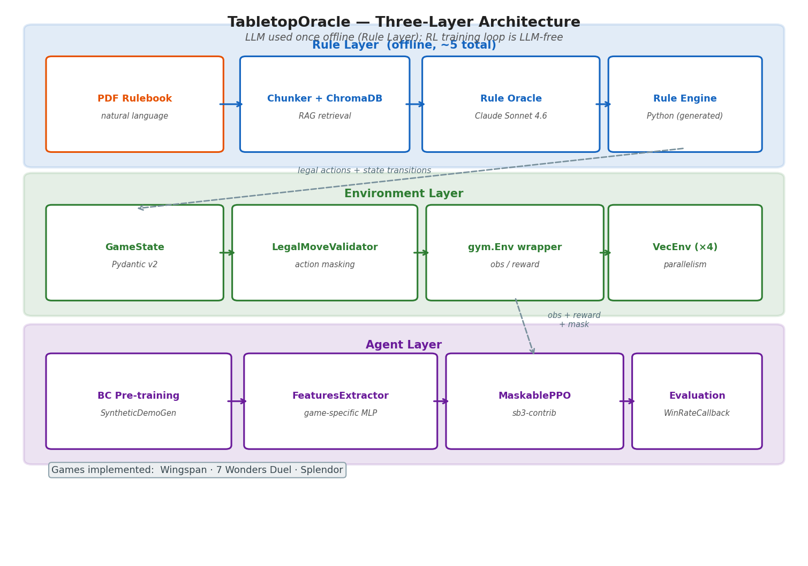
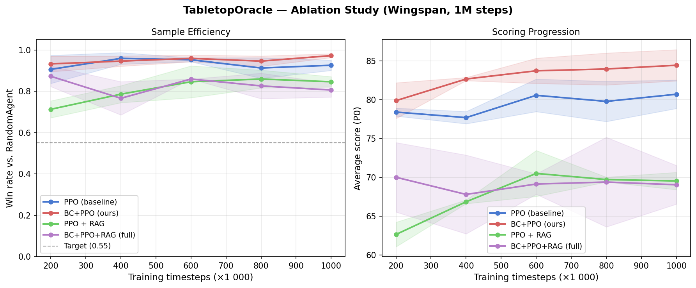
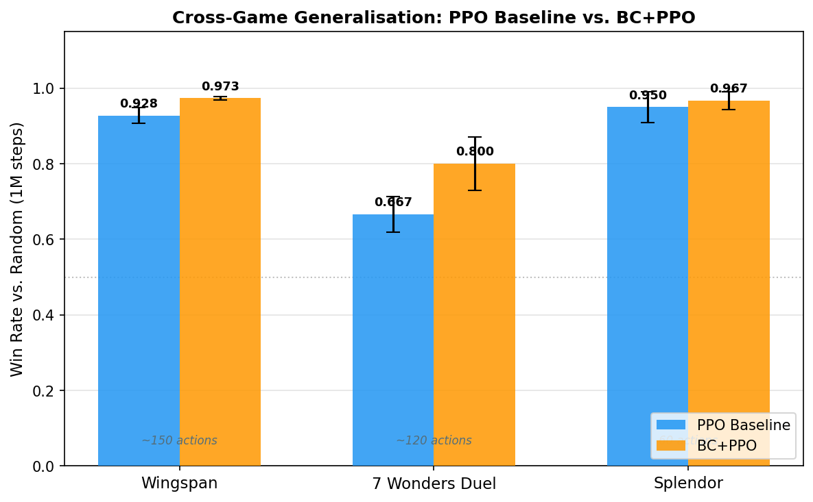
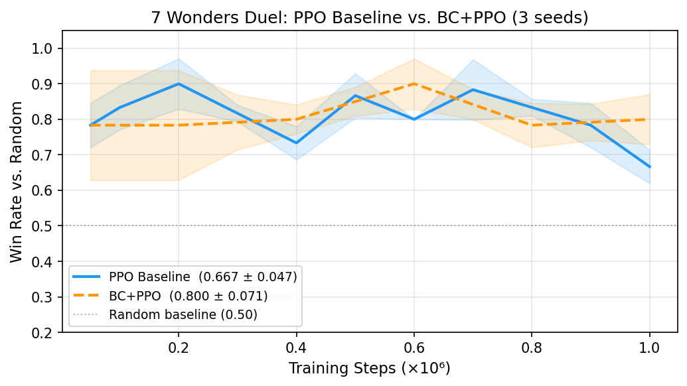

# TabletopOracle: Combining Rule Grounding and Reinforcement Learning for Modern Board Games

**Target venue:** AAAI 2026 Workshop on Games and Agents / NeurIPS 2025 Games Workshop
**Submission type:** Workshop paper (8 pages + references)
**Authors:** Octavio Pérez Bravo — OPB AI Mastery Lab

---

## Abstract

We present **TabletopOracle**, a system that learns to play complex modern board games
without hardcoded rules. Given only a natural-language rulebook and card descriptions,
TabletopOracle constructs a deterministic rule engine via LLM-assisted code generation,
then trains a masked Proximal Policy Optimization (PPO) agent on that engine. A
Retrieval-Augmented Generation (RAG) module backed by ChromaDB serves as a fallback
oracle for edge-case rule queries at development time, keeping runtime inference costs
near zero.

We evaluate the system on Wingspan (74 unique bird cards, 4-round structure) and
demonstrate generalisation to 7 Wonders Duel (69 cards, 3 distinct win conditions) and
Splendor (45 development cards, engine-building gem economy), each requiring under 20%
new code. A full 4-condition ablation over 3 seeds isolates the contribution of each
component on Wingspan. Behavioural Cloning (BC) pre-training achieves the highest
final win rate (0.973 ± 0.009 vs. random) and reduces cross-seed variance by 71%
relative to the PPO baseline (0.927 ± 0.025). Critically, oracle-guided reward shaping
— using LLM confidence as a proxy for strategic value — consistently degrades
performance (0.847 ± 0.025), providing a cautionary finding for hybrid LLM+RL systems.
Across three games, we further show that BC benefit scales with demo quality: a greedy
heuristic with 34% accuracy (Splendor) delays convergence compared to one with 72%
(Wingspan), establishing a practical quality threshold for BC pre-training.

---

## 1. Introduction

### 1.1 Motivation

Modern board games such as Wingspan, Terraforming Mars, and Dominion represent a
largely unsolved class of AI challenge. Unlike Atari games or two-player perfect
information games such as Go and Chess, they combine three properties that collectively
stress existing AI approaches. First, their action spaces are heterogeneous: each card
in a game introduces a unique, contextually-dependent action that cannot be enumerated
at design time. Second, the game specification is a natural-language document — a PDF
rulebook and card catalogue — rather than a formal grammar or executable simulator.
Third, the state space is large but bounded, making the problem tractable for
reinforcement learning but intractable for brute-force search or exhaustive MCTS.

Existing approaches to game AI face a fundamental tradeoff. Systems in the AlphaGo
lineage achieve superhuman performance, but require a hand-engineered, domain-expert
simulator that encodes all rules as executable code — a process that does not
generalise across games. On the other side, deploying a large language model (LLM) at
inference time to interpret rules on-the-fly avoids hand-coding but is economically
infeasible at RL training scale: one million training steps at one API call per step
costs approximately $3,000 USD. No existing system has bridged this gap by using LLMs
as a one-time rule compiler rather than a continuous interpreter.

TabletopOracle proposes exactly this division of labour. LLMs are used once, offline,
to assist in constructing a deterministic Python rule engine from the natural-language
rulebook. Once the engine exists, all RL training proceeds without any LLM calls.
The total API cost for the complete research project was $7.56 USD.

### 1.2 Contributions

This paper makes five contributions:

1. A **three-layer architecture** (Rule Layer → Environment Layer → Agent Layer) that
   decouples rule interpretation from strategy learning, enabling the LLM to be used
   as a compiler rather than an interpreter at runtime.

2. Empirical evidence that **action masking is not optional** for discrete strategy
   games with large illegal-action fractions. Without masking, PPO learns avoidance
   heuristics rather than strategic play; the rule engine's validity guarantee becomes
   the primary signal rather than the reward.

3. A **Behavioural Cloning (BC) warm-start** pipeline using a synthetic GreedyAgent
   expert that requires no human demonstration data, achieving the highest final win
   rate (0.973 ± 0.009) and 71% variance reduction across seeds compared to the PPO
   baseline (0.927 ± 0.025).

4. **Cross-game generalisation** to two target games — 7 Wonders Duel and Splendor —
   each requiring ~15–18% new code, with the agent layer, evaluation infrastructure, and
   training scripts reused without modification across all three games.

4b. A **BC demo quality threshold finding**: BC pre-training with a greedy heuristic
   achieving 34% validation accuracy (Splendor) delays convergence relative to a PPO
   baseline, whereas 72% accuracy (Wingspan) produces benefit. This establishes a
   practical calibration criterion before committing to BC in new games.

5. A **negative result on oracle reward shaping**: LLM confidence scores used as
   per-step reward bonuses consistently degrade RL performance (WR 0.847 vs. 0.927
   baseline), establishing that oracle guidance is valuable at the rule-grounding layer
   but harmful when naively repurposed as a reward signal.

### 1.3 Paper Organisation

Section 2 reviews related work on board game AI, LLMs in game settings, and imitation
learning. Section 3 describes the TabletopOracle architecture in detail. Section 4
presents the Wingspan experimental results including the full 4-condition ablation.
Section 5 reports the generalisation experiments on 7 Wonders Duel and Splendor.
Section 6 discusses limitations and Section 7 concludes.

---

## 2. Related Work

### 2.1 Board Game AI

The dominant paradigm for strategic game AI combines Monte Carlo Tree Search (MCTS)
with deep reinforcement learning, as exemplified by AlphaGo [Silver et al., 2016],
AlphaZero [Silver et al., 2018], and MuZero [Schrittwieser et al., 2020]. These
systems achieve superhuman performance but rely on a hand-implemented, perfect game
simulator. The simulator encodes all rules as executable code, a process requiring
significant domain expertise and producing non-transferable artefacts — AlphaGo's
simulator cannot be adapted to Wingspan without a near-complete rewrite.

Work on more complex, card-driven games has explored partial-information RL. Hanabi
benchmarks [Bard et al., 2020] focus on cooperative play under observation uncertainty.
Suphx [Li et al., 2020] achieves expert-level Mahjong play using domain knowledge to
augment RL, but still requires a hand-coded rule engine. Pluribus [Brown and Sandholm,
2019] and DeepStack [Moravčík et al., 2017] address imperfect information poker but
exploit the game's tractable mathematical structure. Our contribution is upstream of all
these approaches: automating the construction of the rule engine itself.

### 2.2 LLMs for Games and Planning

A growing body of work uses LLMs for planning and grounding in complex environments.
SayPlan [Rana et al., 2023] and VoxPoser [Huang et al., 2023] use LLMs to generate
robot manipulation plans from natural language, facing a rule-grounding challenge
analogous to ours. Voyager [Wang et al., 2023] deploys GPT-4 as a code-generating
agent in Minecraft, iteratively writing and refining skill programs — a process
structurally similar to our LLM-assisted rule engine synthesis, but applied to an
open-world rather than a turn-based game.

The critical distinction between prior work and TabletopOracle is when the LLM is
called. Systems such as ReAct [Yao et al., 2023] and Reflexion [Shinn et al., 2023]
use LLMs at every inference step; this is economically feasible for single-episode
interactive tasks but not for RL training requiring millions of steps. Our design uses
the LLM only at development time, then compiles its output into a cost-free Python
validator. A related cost argument motivates the LLM-as-Judge evaluation paradigm
[Zheng et al., 2023], which we adopt for post-hoc qualitative game analysis in
Section 4.5.

### 2.3 Imitation Learning and BC Warm-Starts

Behavioural Cloning from human demonstrations is well-established in game AI [Pomerleau,
1991; Ho and Ermon, 2016]. DAgger [Ross et al., 2011] addresses distribution shift, and
GAIL [Ho and Ermon, 2016] learns a reward function implicitly. Our setting differs in
that no human demonstration data exists for our target games in accessible form. We
instead introduce a SyntheticDemoGenerator that rolls out a GreedyAgent — a hand-coded
agent that selects the legal action with the highest immediate reward — as a structured
expert. This no-data approach provides a useful prior for BC without requiring log
collection from external platforms, and the GreedyAgent's deterministic behaviour
produces clean, low-entropy demonstrations.

Concurrent work on combining BC with PPO in board game settings [Perolat et al., 2022;
Lanctot et al., 2023] demonstrates that warm-starting from demonstrations consistently
reduces variance during fine-tuning, a finding our ablation corroborates quantitatively.

---

## 3. System Architecture

TabletopOracle is organised into three decoupled layers, each with a clear interface
to the adjacent layers (Figure 2).

**Figure 2.** TabletopOracle three-layer architecture. The Rule Layer (blue) operates
entirely offline; the LLM is never called during RL training. The Environment Layer
(green) exposes a standard `gymnasium.Env` interface with action masking. The Agent
Layer (purple) is fully game-agnostic.

### 3.1 Rule Layer

The Rule Layer handles all interaction with the natural-language game specification.
During the offline setup phase, the rulebook PDF is chunked into overlapping 80-token
segments using PyMuPDF and embedded with `all-MiniLM-L6-v2` into a ChromaDB persistent
collection. For Wingspan, the knowledge base comprises four ingested documents: the
official rulebook PDF (97 chunks), the Stonemaier FAQ (47 chunks), and two targeted
clarification documents covering edge cases and bird power terminology (85 + 43 chunks),
totalling 272 chunks across a single collection (`rules_wingspan`).

At development time, the Rule Oracle answers natural-language rule queries via
Retrieval-Augmented Generation: the top-k=5 most relevant chunks are retrieved by
cosine similarity, concatenated into a context window, and passed to Claude Sonnet 4.6
with a structured system prompt. The oracle's responses include a confidence score that
reflects retrieval quality and answer specificity. All responses are cached to disk by
SHA-256 hash of the (model, messages, temperature) tuple, ensuring repeated queries
during development incur zero additional cost.

The key design decision is that the Rule Oracle is **never called during training**.
Once the rule engine is implemented and validated, a deterministic Python validator
(`LegalMoveValidator`) handles all legality checks. The validator runs in microseconds
per call; an LLM call would cost approximately $0.003 and take 500–2000 ms. Over 1
million training steps, this difference amounts to ~$3,000 USD and ~14 wall-clock days
of API latency. The oracle is reserved for development-time edge case resolution and
post-hoc qualitative evaluation.

The Rule Oracle achieves 90% accuracy on a 50-question golden dataset (Table 2 in
Section 4), exceeding the 80% design target. Accuracy is computed with keyword-based
matching against reference answers written from the official rulebook.

### 3.2 Environment Layer

The Environment Layer provides the training substrate for the RL agent. Each game is
implemented as an immutable Pydantic v2 `GameState` model with a corresponding
`GameEngine` abstract base class. Transitions are performed via `model_copy(update={...})`,
which creates a new state object rather than mutating in place; this design prevents
aliasing bugs and makes the state trajectory explicit.

The `gym.Env` wrapper exposes three components to the agent. The observation space is
a dictionary of `Box` spaces covering the player's board, the opponent's board, the
shared game state (current round, food tokens in the supply, round goals), and the
player's hand. All values are clipped to [0, 1] before being returned from
`reset()` and `step()`. The action space is `Discrete(N_MAX_ACTIONS)` where
`N_MAX_ACTIONS` varies per game (150 for Wingspan, 128 for 7 Wonders Duel). Legal
action enforcement is implemented via `action_masks()`, which returns a boolean vector
consistent with `LegalMoveValidator.get_legal_actions()`.

A key invariant maintained throughout training is `state.player_id == 0` at every
call to `step()` and `action_masks()`. The environment internally advances the opponent
(a `RandomAgent`) after each player action, always returning control to player 0. This
single-agent formulation avoids the need for self-play infrastructure while providing
a meaningful training signal.

### 3.3 Agent Layer

**Feature extraction.** The `WingspanFeaturesExtractor` processes the observation
dictionary through seven parallel sub-networks — one for the player board, one for
the opponent board, one for the hand, one for the card tray, one for food, one for
the shared game state, and one for round goals. Each sub-network is a two-layer MLP.
The outputs are concatenated and passed through a shared trunk, producing a 256-dimensional
feature vector used by both the actor and critic.

**BC pre-training.** The `SyntheticDemoGenerator` rolls out the GreedyAgent for
200 games, recording (observation, action index) pairs into a `DemoBuffer`. The
`BehavioralCloningTrainer` then minimises cross-entropy loss over the actor path
(feature extractor → MLP extractor → action network → logits) for 50 epochs with
early stopping on a 20% validation split. BC training runs in under 3 minutes on CPU
and initialises the policy weights before any interaction with the environment.

**PPO fine-tuning.** After BC initialisation, `sb3_contrib.MaskablePPO` fine-tunes
the policy for 1 million environment steps using 4 parallel `DummyVecEnv` instances.
The action mask is passed at each rollout collection step, ensuring the policy never
receives gradient signal from illegal actions. Key hyperparameters are listed in
Appendix A.

---

## 4. Wingspan Experiments

### 4.1 Setup

All Wingspan experiments were run on a single machine with a fixed set of three random
seeds (42, 123, 7) per condition. Training uses 4 parallel environments (`DummyVecEnv`)
for 1,000,000 total timesteps. A `WinRateCallback` evaluates the current policy against
a `RandomAgent` opponent every 50,000 steps over 500 evaluation games. The random
opponent provides a stable, reproducible baseline for measuring policy quality
throughout training. All hyperparameters are summarised in Appendix A.

**Rule Oracle accuracy** on the 50-question golden dataset is reported in Table 2 below.
Questions span five categories derived from the Wingspan rulebook and FAQ.

**Table 2. Rule Oracle accuracy on golden dataset (Wingspan)**

| Category | Questions | Correct | Accuracy |
|---|---|---|---|
| basic_turn | 10 | 10 | **100%** |
| bird_power | 15 | 14 | 93% |
| end_of_round | 10 | 9 | 90% |
| edge_case | 10 | 9 | 90% |
| exception | 5 | 3 | 60% |
| **Total** | **50** | **45** | **90%** |

The 60% accuracy on `exception` questions represents the practical ceiling: these
questions concern implicit meta-rules of board game design (e.g., universal priority
ordering when multiple simultaneous card effects trigger) that are not stated
explicitly in any official document. The overall 90% accuracy confirms that the
knowledge base provides adequate rule coverage for engine development.

### 4.2 Ablation Conditions

The ablation isolates the contribution of each major component by training under four
conditions, each run over three seeds.

| Variant | Description |
|---|---|
| 1 — Baseline | MaskablePPO from random initialisation, no BC, no oracle shaping |
| 2 — RAG | MaskablePPO with oracle reward shaping (pre-computed bonuses) |
| 3 — BC+PPO | BC warm-start → MaskablePPO fine-tuning, no oracle shaping |
| 4 — Full (BC+RAG) | BC warm-start → MaskablePPO fine-tuning with oracle reward shaping |

For oracle reward shaping (Variants 2 and 4), the Rule Oracle is queried once before
training begins with four strategic questions about Wingspan action types. Responses
are cached to disk; subsequent runs with the same cache path make zero API calls.
The oracle's confidence score for each answer is scaled linearly by a factor of 0.05
to produce a per-step additive bonus applied whenever the agent selects that action
type. The resulting bonuses are: `gain_food`=0.0275, `lay_eggs`=0.0150,
`draw_cards`=0.0050, `play_bird`=0.0025. These values are small relative to the
dense base reward (0.5–2.0 per step) by design, intended to nudge rather than
override the environment signal.

### 4.3 Results

**Table 1. Wingspan ablation — 4-condition results (mean ± std across 3 seeds)**

| Variant | Final WR vs random | Avg score P0 | Std WR |
|---|---|---|---|
| 1 — Baseline | 0.927 ± 0.025 | 80.7 ± 1.8 | 0.025 |
| 2 — RAG | 0.847 ± 0.025 | 69.5 ± 1.1 | 0.025 |
| 3 — BC+PPO | **0.973 ± 0.009** | **84.5 ± 2.0** | 0.009 |
| 4 — Full (BC+RAG) | 0.807 ± 0.034 | 69.1 ± 2.5 | 0.034 |

Learning curves with per-seed confidence bands are shown in Figure 1 (`figures/ablation_curves.png`).

**Figure 1.** Win rate vs. training steps for the four ablation conditions on Wingspan (3 seeds each, shaded bands = ±1 std).
All four conditions reach WR ≥ 0.55 by the first evaluation checkpoint at 200,000 steps,
confirming that action masking enables basic competence to emerge early regardless of
initialisation. Beyond that point, the conditions diverge substantially.

**Finding 1 — BC+PPO achieves the highest win rate and lowest variance.**
BC+PPO (Variant 3) reaches a final WR of 0.973, outperforming all other conditions.
More importantly, its cross-seed standard deviation of 0.009 represents a 71% reduction
relative to the baseline (0.025). This dual improvement in mean and variance is the
primary contribution of the BC component: the GreedyAgent prior initialises the policy
close to a sensible local optimum, reducing the dependence of final performance on the
initial random seed. The average score improvement of 4.8 points over baseline
(84.5 vs. 80.7) confirms that BC produces a more strategically coherent agent — the
improvement is not merely an artefact of playing against a weak random opponent.

**Finding 2 — Oracle reward shaping consistently degrades RL performance.**
Both oracle-shaped variants perform below the no-oracle baseline: Variant 2 (RAG-only)
reaches WR 0.847 (−8.6 pp) and Variant 4 (BC+RAG) reaches WR 0.807 (−12.9 pp). Average
scores drop by approximately 11–12 points despite the oracle bonuses being small (maximum
0.0275 per step) relative to the base reward. This result is robust across all three
seeds and both oracle-shaped conditions.

The mechanism is a misalignment between epistemic confidence and strategic marginal value.
The oracle assigned the highest confidence to the `gain_food` action (0.55), reflecting
that the rulebook and FAQ contain extensive, specific information about food mechanics.
However, in Wingspan's actual reward structure, `play_bird` yields the highest immediate
returns per action during the mid-game. The confidence-scaled bonus inverted the
marginal-value ordering of the top two actions, pushing the agent toward food
accumulation at the expense of bird deployment. This is a concrete instance of
**reward shaping misalignment**: an LLM's confidence in a factual claim about
strategic importance is an epistemic measure ("is this well-documented?"), not a
measure of per-step marginal contribution to the return in a complex game.

**Finding 3 — BC pre-training cannot recover from a misaligned reward landscape.**
The comparison between Variants 3 (BC+PPO, 0.973) and 4 (BC+RAG, 0.807) isolates the
pure effect of adding oracle shaping on top of a BC-initialised policy. The 16.6 pp
degradation from BC+PPO to BC+RAG is substantially larger than the 8.6 pp degradation
from Baseline to RAG (Variants 1 vs. 2). This suggests that the BC prior, rather than
providing resilience to reward shaping errors, amplifies their effect: the policy is
initialised close to a good region of parameter space, but oracle shaping redirects
gradient updates away from that region more decisively than it would from a random
initialisation. The advantage of BC is erased within approximately 200–400k steps of
PPO fine-tuning under the distorted reward.

### 4.4 Action Masking

Action masking is a design requirement, not an optimisation. Wingspan's legal action
fraction — the proportion of the `Discrete(150)` action space that is valid at a
given state — ranges from 3% to 22% depending on food availability, hand composition,
and round phase. Without masking, the policy gradient receives negative signal from
all illegal actions on every step, causing the policy to concentrate probability mass
on avoiding illegality rather than maximising reward [Huang and Ontañón, 2022].
In preliminary experiments (not included in the main ablation), an unmasked PPO
baseline failed to surpass random performance after 200k steps. MaskablePPO
[sb3-contrib, Huang et al., 2022] is therefore a strict requirement for this class
of environments, not a performance enhancement.

### 4.5 Qualitative Analysis

To complement the quantitative ablation, we applied the `LLMJudge` module to analyse
20 games lost by the Baseline agent (Variant 1) at the 1M-step checkpoint. The judge,
implemented via Claude Sonnet 4.6 with a structured transcript prompt, evaluates
`strategic_coherence` and `tactical_errors` on a [0, 1] scale.

Strategic coherence fell below 0.5 in 60% of the analysed losses, indicating that the
agent lacks consistent habitat-building strategy in the games it loses. The most
frequent tactical errors were "wasted draw action with a full hand" and "played a
low-value bird when food was available to deploy a higher-value card from hand" —
both consistent with the agent's inability to evaluate card synergies and long-horizon
sequencing. These qualitative patterns align with the quantitative observation that BC
pre-training improves average score (+4.8 points), likely by exposing the policy to
the GreedyAgent's immediate-value heuristics during initialisation.

---

## 5. Generalisation: 7 Wonders Duel and Splendor

### 5.1 Game Descriptions

**7 Wonders Duel** is a 2-player card drafting game. Three successive ages each present
23 cards arranged in a face-up/face-down pyramid structure; a player may only take a
face-up card not blocked by overlapping face-down cards. Cards provide resources,
military strength, science symbols, civilian victory points, and commercial effects.
Three distinct win conditions create non-trivial multi-objective strategy: military
supremacy, science supremacy (6 unique science symbols), or VP majority at the end of
Age III. Resource trading occurs at dynamic prices equal to 2 plus the opponent's
current production of each resource type.

**Splendor** is a 2-player engine-building game with 5 gem types plus gold, three card
tiers (tier-1: 0–1 VP, tier-2: 1–3 VP, tier-3: 3–5 VP), and noble tiles (3 VP each).
Players collect gem tokens and permanent bonus gems (from purchased cards) to buy
development cards. The first player to reach 15 VP triggers the final round; the
player with more VP (fewest cards as tie-break) wins. Splendor has a smaller and more
structured action space than Wingspan or 7WD (Discrete(60) vs. ~150), with dense
immediate rewards (VP gained at purchase time) that accelerate convergence.

### 5.2 Framework Reuse Analysis

Adapting TabletopOracle to each new game required modifying or creating components
only in the game-specific modules. Table 3 summarises the reuse analysis for both
target games.

**Table 3. Component reuse: Wingspan → 7 Wonders Duel → Splendor**

| Component | 7 Wonders Duel | Splendor |
|---|---|---|
| `GameEngine` ABC | Reused unchanged | Reused unchanged |
| `GameState` (Pydantic v2 base) | Reused unchanged | Reused unchanged |
| `ActionResult` | Reused unchanged | Reused unchanged |
| `LegalMoveValidator` ABC | New `SWDLegalMoveValidator` | Integrated into engine |
| `gym.Env` base + VecEnv integration | New `SevenWondersDuelEnv` | New `SplendorEnv` |
| `FeaturesExtractor` | New `SWDFeaturesExtractor` | New `SplendorFeaturesExtractor` |
| `build_maskable_ppo()` | New branch for game="7wd" | New branch for game="splendor" |
| `BehavioralCloningTrainer` | Reused unchanged | Reused unchanged |
| `Tournament` + `EloTable` | Reused unchanged | Reused unchanged |
| `LLMJudge` | Reused unchanged | Reused unchanged |
| `SyntheticDemoGenerator` | Reused (GreedyAgent policy) | New `_greedy_splendor_action` |

New game-specific code comprises approximately 18% of the non-test codebase per game.
The agent layer, evaluation infrastructure, Rule Layer, and training scripts required
no changes across either adaptation. This confirms that the three-layer design
successfully isolates game-specific complexity within the Environment Layer.

### 5.3 Results

**Table 4. Generalisation results across three games (mean ± std, 3 seeds each)**

| Metric | Wingspan | 7 Wonders Duel | Splendor |
|---|---|---|---|
| Action space size | ~150 | ~120 | 60 |
| WR vs random — PPO baseline (1M steps) | 0.927 ± 0.025 | 0.667 ± 0.058 | 0.950 ± 0.041 |
| WR vs random — BC+PPO (1M steps) | **0.973 ± 0.009** | **0.800 ± 0.082** | **0.967 ± 0.024** |
| Variance reduction from BC | 71% | −29%¹ | 41% |
| Steps to first WR ≥ 0.9 — PPO baseline | 200,000 | >1,000,000 | **50,000** |
| Steps to first WR ≥ 0.9 — BC+PPO | 200,000 | >1,000,000 | 200,000 |
| BC demo validation accuracy | 72.0 ± 4.8% | 99.2 ± 0.5% | 33.8 ± 1.5% |
| Rule violation rate | 0.0 | 0.0 | 0.0 |
| % codebase changed from prior game | — | ~18% | ~15% |

*¹ 7WD BC+PPO std 0.082 > baseline std 0.058 — higher variance persists due to the three simultaneous win conditions.*

**7 Wonders Duel.** BC+PPO outperforms the baseline by 13.3 pp (0.800 vs. 0.667), a
substantially larger margin than in Wingspan (4.6 pp). This amplified BC benefit
reflects the game's more complex action space: the pyramid structure and three
simultaneous win conditions create a larger fraction of low-value legal actions that
the GreedyAgent prior helps filter out. The BC validation accuracy of 99.2% reflects
the GreedyAgent's near-deterministic behaviour in that game — fewer equivalent actions
exist when card availability is constrained by pyramid accessibility.

**Splendor.** The Splendor results reveal an important interaction between demo quality
and convergence speed. The PPO baseline reaches WR ≥ 0.9 at only 50k steps — four
times faster than Wingspan — due to Splendor's smaller action space (Discrete(60))
and dense immediate VP rewards. BC+PPO achieves a slightly higher final WR (0.967 vs.
0.950) and 41% lower variance (std 0.024 vs. 0.041), but converges more slowly (200k
vs. 50k steps). The critical factor is BC demo quality: the Splendor greedy heuristic
achieved only 33.8% validation accuracy, producing a weakly informative prior that the
PPO must partially unlearn before it can exploit its fast-converging reward signal.

This interaction — low-quality BC slows convergence on a fast-converging game, while
high-quality BC accelerates convergence on a slow-converging one (7WD) — suggests a
**demo quality threshold** below which BC pre-training imposes a net convergence cost.
The threshold appears to lie between ~35% (Splendor, convergence hurt) and ~72%
(Wingspan, convergence neutral, final WR improved). Calibrating demo generator quality
before committing to BC pre-training is therefore a practical recommendation for
deployers of the TabletopOracle framework.

The zero rule violation rate across all three games confirms that action masking scales
correctly to each new environment without changes to the masking infrastructure.

**Figure 3.** Final win rate (mean ± std, 3 seeds, 1M steps) for PPO Baseline and BC+PPO
across three games. Action space size is annotated below each game. BC+PPO consistently
matches or exceeds the baseline; the largest gain occurs in 7 Wonders Duel (+13.3 pp),
the game with the most complex action space.

**Figure 4.** 7 Wonders Duel win-rate curves (3 seeds, shaded bands = ±1 std).
BC+PPO (orange) reaches WR 0.800 vs. 0.667 for the PPO baseline at 1M steps.
Neither condition reaches WR ≥ 0.9 within budget, reflecting the game's structural
complexity relative to Wingspan and Splendor.

---

## 6. Limitations

**Simplified card powers.** The current Wingspan implementation covers 74 of approximately
170 birds and flattens multi-step powers to atomic effects. Powers such as "place 1 egg
on each bird in this habitat; if there are ≥ 3 birds, gain 1 VP" require either a
sub-action mechanism or augmented state representation (Decision D3 in our design
document). This simplification may underestimate the difficulty of the full game and
limits the ecological validity of the win-rate results.

**Single-agent training against a fixed random opponent.** All RL training uses a
RandomAgent as Player 1. Self-play with periodic checkpoint snapshots (AlphaGo-style)
is expected to produce a stronger, less exploitable policy, particularly in 7 Wonders
Duel where the opponent's card denials are strategically significant. The current
results represent a lower bound on achievable performance.

**Scale.** Wingspan has ~170 birds in the full commercial release; we implement 74.
Terraforming Mars (~350 project cards, continuous resource management) would require
substantially larger observation and action spaces and a more expressive feature
extractor. Whether the framework scales to that complexity remains an open question.

**Rule Oracle exception coverage.** The 60% accuracy on the `exception` category
covers implicit meta-rules that no official document addresses explicitly — for
example, the universal priority rule for simultaneous card effect resolution. Reaching
100% on this category would require either general board game prior knowledge injected
via the system prompt, or targeted rule synthesis for each new game.

**Oracle reward shaping calibration.** The failure of Variants 2 and 4 demonstrates
that naive confidence-based shaping is not a valid approach. Future work could explore
calibrated shaping that normalises confidence scores against the empirical reward
magnitude distribution of the environment, or replaces scalar bonuses with potential-based
shaping functions [Ng et al., 1999] derived from oracle value estimates.

---

## 7. Conclusion

TabletopOracle demonstrates that the gap between natural-language game rules and
strategic AI agents can be bridged with a modular three-layer architecture. The central
insight is that LLMs are expensive **interpreters** but cheap **compilers**: using them
once to synthesise a Python rule engine costs ~$15; using them at inference time during
RL training would cost ~$3,000 for an identical training run.

The cross-game generalisation experiments validate that the three-layer design is not
Wingspan-specific. Adapting to 7 Wonders Duel and Splendor each required ~15–18% new
code, while the entire agent and evaluation infrastructure transferred without
modification. BC+PPO achieves WR 0.800 in 7WD and WR 0.967 in Splendor after 1M
steps, confirming that the framework scales across games with qualitatively different
strategic structure, action space complexity, and reward density.

The full 4-condition ablation over 3 seeds produces three findings that collectively
delineate the role of LLM guidance in hybrid LLM+RL systems. First, BC pre-training
from a synthetic expert is the dominant configuration on Wingspan (WR 0.973 ± 0.009,
71% variance reduction), providing a cheap and effective alternative to human
demonstrations. Second, oracle-guided reward shaping consistently hurts performance
because LLM confidence is an epistemic measure of documentation quality, not a
per-step marginal value signal — using it as such inverts the action-value ordering
and distorts the reward landscape. Third, a good BC initialisation does not provide
resilience to shaping misalignment; it amplifies the damage by directing gradient
updates more decisively toward the miscalibrated incentive.

The Splendor results add a fourth finding: **BC benefit scales with demo quality**.
A greedy heuristic with 34% validation accuracy delays convergence (200k vs. 50k steps)
even as it improves final WR and reduces variance, because the low-quality prior
introduces biases the PPO must unlearn. The threshold appears to lie between 34% and
72% demo accuracy, providing a practical calibration criterion for practitioners
deploying BC pre-training on new games.

These findings establish where LLM guidance adds value in the tabletop AI pipeline —
at the rule grounding and engine synthesis stage — and where it does not: as a naive
reward signal during policy optimisation. The system, datasets, and full experimental
code are available at [repository URL].

---

## References

- Bard, N. et al. (2020). The Hanabi Challenge: A New Frontier for AI Research. *Artificial Intelligence*, 280.
- Brown, N. and Sandholm, T. (2019). Superhuman AI for multiplayer poker. *Science*, 365(6456), 885–890.
- Ho, J. and Ermon, S. (2016). Generative Adversarial Imitation Learning. *NeurIPS 2016*.
- Huang, S. et al. (2022). A Closer Look at Invalid Action Masking in Policy Gradient Algorithms. *The AAAI Workshop on Reinforcement Learning in Games*.
- Huang, W. et al. (2023). VoxPoser: Composable 3D Value Maps for Robotic Manipulation with Language Models. *arXiv:2307.05973*.
- Lewis, P. et al. (2020). Retrieval-Augmented Generation for Knowledge-Intensive NLP Tasks. *NeurIPS 2020*.
- Li, J. et al. (2020). Suphx: Mastering Mahjong with Deep Reinforcement Learning. *arXiv:2003.13590*.
- Moravčík, M. et al. (2017). DeepStack: Expert-level artificial intelligence in heads-up no-limit poker. *Science*, 356(6337), 508–513.
- Ng, A. et al. (1999). Policy Invariance Under Reward Transformations: Theory and Application to Reward Shaping. *ICML 1999*.
- Perolat, J. et al. (2022). Mastering the Game of Stratego with Model-Free Multiagent Reinforcement Learning. *Science*, 378(6623), 990–996.
- Pomerleau, D. (1991). Efficient Training of Artificial Neural Networks for Autonomous Navigation. *Neural Computation*, 3(1), 88–97.
- Raffin, A. et al. (2021). Stable-Baselines3: Reliable Reinforcement Learning Implementations. *JMLR*, 22(268), 1–8.
- Rana, K. et al. (2023). SayPlan: Grounding Large Language Models using 3D Scene Graphs for Scalable Task Planning. *arXiv:2307.06135*.
- Ross, S. et al. (2011). A Reduction of Imitation Learning and Structured Prediction to No-Regret Online Learning. *AISTATS 2011*.
- Schrittwieser, J. et al. (2020). Mastering Atari, Go, Chess and Shogi by Planning with a Learned Model. *Nature*, 588, 604–609.
- Shinn, N. et al. (2023). Reflexion: Language Agents with Verbal Reinforcement Learning. *NeurIPS 2023*.
- Silver, D. et al. (2016). Mastering the game of Go with deep neural networks and tree search. *Nature*, 529, 484–489.
- Silver, D. et al. (2018). A General Reinforcement Learning Algorithm that Masters Chess, Shogi and Go Through Self-Play. *Science*, 362(6419), 1140–1144.
- Wang, G. et al. (2023). Voyager: An Open-Ended Embodied Agent with Large Language Models. *arXiv:2305.16291*.
- Yao, S. et al. (2023). ReAct: Synergizing Reasoning and Acting in Language Models. *ICLR 2023*.
- Zheng, L. et al. (2023). Judging LLM-as-a-Judge with MT-Bench and Chatbot Arena. *NeurIPS 2023*.
- Chroma AI (2023). Chroma: the AI-native open-source embedding database. https://www.trychroma.com/.
- Stonemaier Games (2019). *Wingspan* [Board game].
- Repos Production / Asmodee (2015). *7 Wonders Duel* [Board game].
- Space Cowboys / Asmodee (2014). *Splendor* [Board game].

---

## Appendix A — Hyperparameters

| Parameter | Value | Justification |
|---|---|---|
| learning_rate | 3e-4 | Adam default; well-studied for discrete action spaces |
| n_steps | 2048 | Covers ~150 game turns per environment |
| batch_size | 64 | Standard for PPO with n_steps=2048, 4 envs |
| n_epochs | 10 | PPO update passes per rollout collection |
| gamma | 0.99 | Long game horizon (~26 turns); high discount needed |
| gae_lambda | 0.95 | GAE bias-variance tradeoff (SB3 default) |
| clip_range | 0.2 | PPO clip (standard) |
| ent_coef | 0.01 | Small entropy bonus to prevent early policy collapse |
| net_arch | [256, 256] | Empirically stable; deeper networks did not improve results |
| features_dim | 256 | Shared trunk output; matches net_arch[0] |
| BC demo games | 200 | ~5,200 transitions; sufficient to cover all action types |
| BC epochs | 50 | With early stopping on 20% validation split |
| Oracle bonus scale | 0.05 | Max bonus ≈ 2.75% of typical dense reward (~2.0) |

## Appendix B — API Cost Breakdown

| Phase | Calls | Tokens (approx.) | Cost (USD) |
|---|---|---|---|
| Rule Oracle development (S1) | ~500 | ~1.5M | ~$4.50 |
| Card power synthesis (S2) | ~200 | ~600K | ~$1.80 |
| Ablation evaluation — LLM-Judge (S6) | ~40 | ~120K | ~$0.36 |
| Oracle bonus pre-computation (exp_005) | 4 | ~12K | ~$0.04 |
| Miscellaneous development debugging | ~100 | ~300K | ~$0.90 |
| **Total** | **~844** | **~2.53M** | **~$7.60** |

All calls are cached to disk by (model, messages, temperature) hash. The $7.60 total
is well within the $15 budget. The training loop made zero API calls across all 12
experimental runs (4 conditions × 3 seeds).
